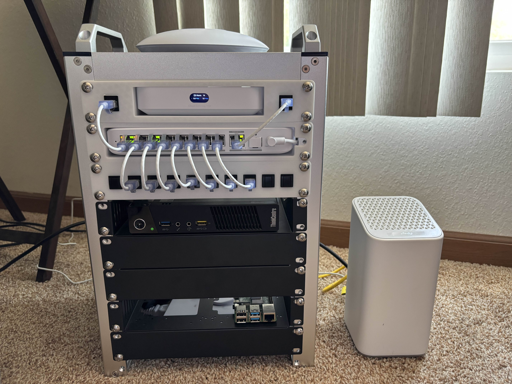

This is my **homelab**, a project that has been a ton of fun and a learning experience. It's always a work in progress, but I'm proud of the setup and how it's evolved.

### Current Hardware:
* 10U Rackmate T1 : Mini rack
* [Unifi U7 Lite](https://techspecs.ui.com/unifi/wifi/u7-lite) : Access Point
* [Unifi Cloud Gateway Max](https://techspecs.ui.com/unifi/cloud-gateways/ucg-max?subcategory=all-cloud-gateways) : Router
* [Unifi Flex 2.5G PoE](https://techspecs.ui.com/unifi/switching/usw-flex-2-5g-8-poe?subcategory=all-switching) : Switch
* [Unifi Flex Mini 2.5G](https://techspecs.ui.com/unifi/switching/usw-flex-2-5g-5?subcategory=all-switching) : Switch
* Lenovo ThinkCentre M93 : ProxmoxVE : i5-4570T, 8Gb DDR3, 1Tb SSD

### Services:
* Pi-hole for network-wide adblocking
* Self-hosted GitHub runner for my CI/CD pipeline, which uses [Terraform](terraform/) to automate deployment of VMs
* Pangolin for a secure reverse proxy from an AWS Lightsail instance into my home network
* Pterodactyl for hosting game servers

### What's Next? I have a few upgrades planned:
* Expanding the Terraform pipeline by using Ansible to automate VM configuration after creation.
* Implementing a Grafana stack to collect and visualize metrics and logs from services.
* Two more mini PCs for a high-availability Proxmox cluster
* A NAS for PVE backups and centralized storage
* A UPS for battery backup